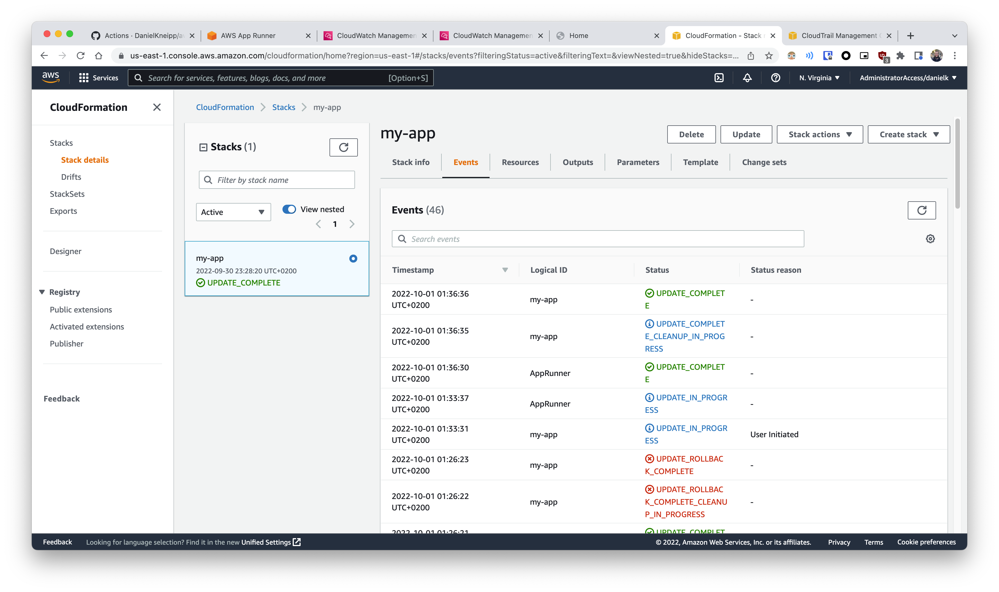

# App with self-contained infrastructure on AWS

This repo contains an example app with self-contained infrastructure-as-code. With less places to go, the developers has access to not only to the app, but also relevant parts of the infrastructure used to deploy it, allowing him/her to evaluate and change the deployment configuration.

- [App with self-contained infrastructure on AWS](#app-with-self-contained-infrastructure-on-aws)
  - [Context](#context)
  - [Overall Architecture](#overall-architecture)
  - [Platform Side](#platform-side)
    - [Giving Github access to AWS](#giving-github-access-to-aws)
      - [How to get thumbprint value](#how-to-get-thumbprint-value)
    - [Giving AWS App Runner Access to Github](#giving-aws-app-runner-access-to-github)
    - [Wrap-up](#wrap-up)
  - [Development Side](#development-side)
    - [Code quality checks](#code-quality-checks)
    - [Sync infrastructure](#sync-infrastructure)
    - [Trigger the app deployment](#trigger-the-app-deployment)
      - [Why API-triggered deployment?](#why-api-triggered-deployment)
  - [Putting everything together](#putting-everything-together)
    - [Update procedure](#update-procedure)
    - [About how to refine the AWS role for Github](#about-how-to-refine-the-aws-role-for-github)
  - [Clean-up](#clean-up)

## Context

More often than not, we see in companies developers struggling understating how their apps are actually being deployed. Usually they're limited to their local deployments with tools like `docker-compose` and testing environments, which can diverge significantly form production environments (where they some times don't have access to).

At the same time, the platform/infrastructure team responsible to prepare the production environments, don't have specific knowledge about individual apps, forcing them to apply sensible defaults that might work, but won't be optimized configurations for each app.

*This creates the infamous Dev and Ops cilos, where those two teams struggle to communicate to achieve production-ready and optimized deployments.*

DevOps practices should help avoid this exact situation. Through automation, here is shown how an application deployment could be managed by developers directly from their own app repository.

This brings the infrastructure and deployment configuration closer to where the know-how about the app is: the development team. This way they can take ownership and control not only the app itself, but how it should deployed, including which cloud resources it needs in an independent fashion.

## Overall Architecture

The way we're going to achieve that is by:

- Preparing a base infrastructure that allows automation pipelines to manage resources in the cloud
- Creating a pipeline that allows the management of the necessary cloud resources

This allows us to have a clear separation of duties between teams (platform team manages cloud governance and development team manages the workloads), while given the development team arguably all control of their app (code and infrastructure).

Translating this strategy to the directories we have in this repo, this is what we have:

```txt
+---------------+    +------------------+
| Development   |    | Platform         |
|               |    |                  |
|   +---------+ |    |   +------------+ |
|   | aws     | |    |   | terraform  | |
|   +---------+ |    |   +------------+ |
|               |    |                  |
|   +---------+ |    +------------------+
|   | app     | |
|   +---------+ |
|               |
|   +---------+ |
|   | .github | |
|   +---------+ |
|               |
+---------------+
```

The breakdown is:

| Directory    | Description |
|--------------|-------------|
| `terraform/` | Contains the the necessary infrastructure to allow the Github Workflow (our automation tool for this example) to access and manage resources in AWS (our cloud provider). It usually would be in an independent repo managed by the platform team, but we will keep it here to for simplicity. |
| `aws/`       | Has the Cloudformation stack definition (the cloud resources management tool used by the Development, which can, and in this case will, diverge from the tool used by the platform team). There we can see the cloud resources used by the app (an [AWS App Runner]( https://aws.amazon.com/pt/apprunner/ )), compute resources required, listening port, how it should be built and executed. |
| `app/`       | The app itself, which is just a python Front-end app that has one static index page and one dynamic page. |
| `.github/`   | Contains the Github workflow used to sync the code in  `main`  branch (app and its infrastructure) with the AWS account. |

In a nutshell, the way that it works is:

- Github workflow assumes an AWS role provided by the platform team
- The workflow deploys and keeps the Cloudformation stack with the App Runner service up to date
- And if something change in the app code, the workflow also trigger the service redeployment via AWS API.

If you are more of a visual learner, here is a diagram of how the whole integration is suppose to work, together with the separation of duties:


So let's jump into the implementation details!

## Platform Side

As state before, the platform responsibility will be to provide a way for the Github workflow to mange the app's infrastructure. And also, one thing that hasn't being mentioned, App Runner needs to have access to the code repo in order to deploy the app. Both will be addressed by the platform.

### Giving Github access to AWS

Following security best practices, we will use a AWS role assumed by the workflow to interact with the cloud resources. This will avoid the usage of static credentials that could be leaked and have the time-consuming manual task of having to be rotated regularly.

To give permissions to the workflow without the use of any kind of static credentials, we will set-up on AWS an identity provider that will allow the workflows of this repo (`main` branch specifically) to assume a role on AWS. This restriction is defined as a role condition with the verification of the attribute value of `token.actions.githubusercontent.com:sub` (`terraform/iam-gh.tf` file). Pattern can be used to give a more broad permission to all branches or to all repos of the owner. You can go to the [Github docs](https://docs.github.com/en/actions/deployment/security-hardening-your-deployments/configuring-openid-connect-in-amazon-web-services) to know more about the OIDC configurations (and [here](https://docs.aws.amazon.com/IAM/latest/UserGuide/id_roles_create_for-idp_oidc.html) is also the AWS documentation about the subject)

With the role defined, it's only a matter of defining a policy that will allow the workflow to do its job and associate it with the role. In this example, we're giving very broad permissions (basically Cloudformation and App Runner administrator permissions) to keep the policy small and simple.

> However, in practice, you would want to restrict this policy to specific actions (maybe deny `Delete*` actions) and to resources of a specific app (using patter matching to only allow the manipulation of a cloudformation stack that has a specific name)

To put everything into action, just run `cd terraform/ && terraform apply`. 6 resources will be created in total. The one value you will need is the output `gh_role_arn`, which is the ARN of the role and will be used by the workflow for authentication. You will be able to see the ARN after applying the code, or also you can run `terraform output gh_role_arn` after the fact. This value needs to be shared with the Development team so they can configure the workflow with the properly.

#### How to get thumbprint value

One configuration that worth a bit of explanation of is Thumbprint that needs to be specified for the OIDC identity provider. That is basically the fingerprint of the certificate of Github. Basically, AWS needs this in order to trust on Github as an identity provider (given the current certificate used by Github's domain).

AWS has a [step-by-step guide](https://docs.aws.amazon.com/IAM/latest/UserGuide/id_roles_providers_create_oidc_verify-thumbprint.html) on how to get this value. And here is the automate script for the process described there:

```bash
# The issuer can be obtained at https://docs.github.com/en/actions/deployment/security-hardening-your-deployments/about-security-hardening-with-openid-connect
issuer_url='https://token.actions.githubusercontent.com/.well-known/openid-configuration'
servername="$(curl -s "${issuer_url}" | jq -r '.jwks_uri' | sed -e 's|^[^/]*//||' -e 's|/.*$||')"
cert_info="$(echo -n | openssl s_client -servername "${servername}" -showcerts -connect "${servername}":443 2>/dev/null)"
last_cert="$(echo "${cert_info}" | awk '/-----BEGIN CERTIFICATE-----/{s=""} {s=s$0"\n"} /-----END CERTIFICATE-----/{cert=s} END {print cert}')"
echo "${last_cert}" | openssl x509 -fingerprint -noout | cut -d "=" -f2 | sed -e 's/://g' | tr '[:upper:]' '[:lower:]'
```

### Giving AWS App Runner Access to Github

So far that we allowed Github to talk with AWS. Now it's time to allow AWS to talk with Github. This is something specific for [App Runner](https://aws.amazon.com/apprunner/?nc1=h_ls), which is just one of many ways to deploy a production-ready web application on AWS. With automatic auto-scaling, logging management and ingress configuration with public domain, we will go with this one for today 😅

App Runner allows us to deploy services using container images or directly from the code. For the sake of simplicity, we will go with the latter in this example to simplify the resources required on AWS by the development team and the upgrade procedure for the app.

To allow App Runner to access the code on Github, "AWS Connector for Github" needs to be installed in your Github account. In order to do that, follow the below steps

| Step number | Description | Image |
| ----------- | ----------- | ----- |
| 1 | Go to App Runner console page and click on "Create an App Runner service" |  |
| 2 | Select "Source code repository" and "Add new" to create a connection to a Github account or organization |  |
| 3 | A new windows will popup. There you can give the connection a name and select "Install another" to initiate the installation of the AWS app for Github |  |
| 4 | After logged in your Github account, review and authorize the connector to perform its duties |  |
| 5 | After authorizing the app, confirm its permissions and confirm the AWS app installation |  |
| 6 | The Github connector has been installed and now it can be selected. Select it and press "Next" to close the window |  |
| 7 | Now go the Github connections on the top-left of the previous page |  |
| 8 | There you can see the ARN of the connector, *which will also be required by the development team* |  |

> **Note**: this process could by partially automated by the use of a terraform resource called [`aws_apprunner_connection`](https://registry.terraform.io/providers/hashicorp/aws/latest/docs/resources/apprunner_connection), however, the connector installation on your Github account would still be required to be performed manually (steps 4 and 5)

### Wrap-up

After those two actions, three pieces of information need to be shared with the development team:

- The AWS region name available
- The ARN of the role that will be used by the Github workflow
- The ARN of the Github connector created for App Runner

## Development Side

With the base infrastructure ready to go, now it's time to talk about the automated pipeline with Github Actions. In summary, it has three main functionalities:

- Run code quality checks with `pre-commit`
- Sync infrastructure changes made on `aws/app-template.yaml` with the existing cloud resources
- Trigger the app redeployment if changes happened inside `app/`

> The workflow only runs on the `main` branch, but you can expand the logic steps to the process you and your team might be following.

Let's talk about each individual functionality

### Code quality checks

[`pre-commit`](https://pre-commit.com/) is a really good tool to avoid mistakes before committing (hence, the name). Locally the developer should run `pre-commit install` after cloning the repo and installing the `pre-commit` tool. After this, automatic checks will be execute right after running a `git commit`.

In this repo we have:

- Some standard checks for empty new line as end of file and trailing white spaces. These will be executed on all files of the repo.
- A python formatter called `black`, since our front-end app is made in python.
- A linter for our AWSCloudformation stack called [`cfn-lint`](https://github.com/aws-cloudformation/cfn-lint)
- Security checks for the Cloudformation stack using [`cfn-nag`](https://github.com/stelligent/cfn_nag)

> In the future a cost estimation could be made using the [aws cli](https://awscli.amazonaws.com/v2/documentation/api/latest/reference/cloudformation/estimate-template-cost.html). However, App Runner is not currently supported by the cost estimator. Potential command for future reference: `aws cloudformation estimate-template-cost --template-body file://aws/app-template.yaml --parameters "ParameterKey=RepoUrl,ParameterValue='',UsePreviousValue=true" "ParameterKey=GithubConnArn,ParameterValue='',UsePreviousValue=true"`

Normally those checks are executed in the local machine right before the commit, however, since in some cases the developer forgets to run `pre-commit install`, those checks are also executed in the workflow.

### Sync infrastructure

This is the moment where the Cloudformation stack gets updated (in case of a change and the stack already exists) or created (in case there is no stack with the specified name).

In order to achieve this, AWS credentials need to be properly configured. Here we use a handy Github action called [`configure-aws-credential`](https://github.com/aws-actions/configure-aws-credentials), from AWS itself. You can also read more about the [many methods of authentication](https://github.com/aws-actions/configure-aws-credentials) available. This step requires the `AWS_REGION` and `AWS_ROLE_ARN` secrets to be properly configured in the repo, both of which that should be shared by the platform team.

With the authentication in order, it's time to trigger the Cloudformation creation/update. [`aws-cloudformation-github-deploy`](https://github.com/aws-actions/aws-cloudformation-github-deploy) action is used for that. Although the action was archived, it stills works just fine, so I'll keep it for now. This action will deploy our `aws/app-template.yaml` stack, which has the configuration to build and run the service, as well as its resource usage.

> ⭐️ Notice that this empowers the developers to configures many more things about the deployment (please, see [AWS docs](https://docs.aws.amazon.com/AWSCloudFormation/latest/UserGuide/aws-resource-apprunner-service.html) to see other App Runner configurations). Also, since this is Cloudformation template, with given enough permissions, the development team could specify many more cloud resources that the app might need, like dedicated message queues, S3 buckets, Databases, etc.

### Trigger the app deployment

In case the python code has changed, AWS cli tool is installed to trigger the redeployment of the App Runner service, essentially, updating it.

The script first get the ARN of the App Runner service from one of the outputs of the Cloudformation Stack. With that it triggers the redeployment

#### Why API-triggered deployment?

You might be wondering why the App Runner service hasn't been configured with automatic deployments enabled? *Because if we had enable it, every change on the infrastructure code would yeld a failed workflow execution.*

With automatic deployments enabled, the App Runner service would enter in a state of "Operation in progress" (which can take several minutes) on every code change. If the workflow tries to change the App Runner service (part of the infrastructure code) while the service is in that state, Cloudformation receives an error like `"Resource handler returned message: "Service cannot be updated in the current state: OPERATION_IN_PROGRESS. ..."`.

So, in order to avoid that, the app redeployment/update can only happen after an infrastructure change has concluded. This way the infrastructure can be changed without worrying about if the service is in a "Operation in progress" state.

## Putting everything together

Now we have everything in place. Just pushing this repo to Github (with the proper name based on the AWS role), and the workflow should be able to create the Cloudformation stack. If everything goes according to the plan, you should be able to see the Cloudformation console similar to this:



And going to the "Outputs", you should be able to see the url of the app. If the app is running properly, you will see:

| Page Description | Image |
| ---------------- | ----- |
| Index page |  |
| Dynamic page accessed via custom path |  |

And you can also see general information about the app just deployed in the AWS App Runner console:


There you be able to see lots of useful information, like:

- Logs of the deployment/update procedure, as well as the logs of the app itself
- Metrics of app usage like request count (with status code), compute resource usage and request latency, to name a few
- Activity log with the changes applied to the service, allowing later auditing

And since those logs and metrics are integrated with Cloudwatch, you can later filter query and post-process that telemetry data as you wish. Here is an example of the cpu usage of several different instances of the app deployed on Cloudwatch.


And to see the app logs, you can do the following:

| Step | Description | Image |
| ---- | ----------- | ----- |
| 1 | Go to the available Log Groups on CloudWatch. There you will spot log groups associated with the `my-app-service` app: `application` and `service`. `service` is related build process performed on deployment/update events. We want to access the `application` logs |  |
| 2 | There you can add a new column to sort by creation date the streams available. This way you will easily get the latest logs |  |
| 3 | Clicking on on of those streams you should be able to see the logs of the python web server |  |

> **Tip**: The log groups created by App Runner don't have a retention period. Remember to configure a retention period on your log groups to avoid unnecessary recurrent costs 😉

Because of those features and others that could be enabled (like tracing), App Runner shows itself to be a quick way to deploy reliable and maintainable web apps.

### Update procedure

And what needs to be done in order to update the running app? Just change the python or html code and **push it to the `main` branch**! The workflow will do the rest. The developer only needs view access to the AWS console. Any write interaction is made either by the workflow or the platform team.

### About how to refine the AWS role for Github

Here's a quick tip about how to improve the role created for the Github workflow. With a more permissive role, you can see on CloudTrail exactly what actions the role perform on normal operations. Filtering the events by the user name `GithubActions`, you can determine each individual event generated by the role, as shown below.


From there you can get the actions that need to be allowed and the resources associated with those actions. This will allow you to specify a well-refined role that follows the [least privilege principle](https://en.wikipedia.org/wiki/Principle_of_least_privilege).

## Clean-up

In order to clean-up this while demo, just:

- Delete the Cloudformation stack created
- Delete the CloudWatch log groups associated with the app
- Run `cd terraform &&terraform destroy`

You can also delete the AWS connector on Github and the Github connection on the App Runner console if you don't intent to use that integration again.
